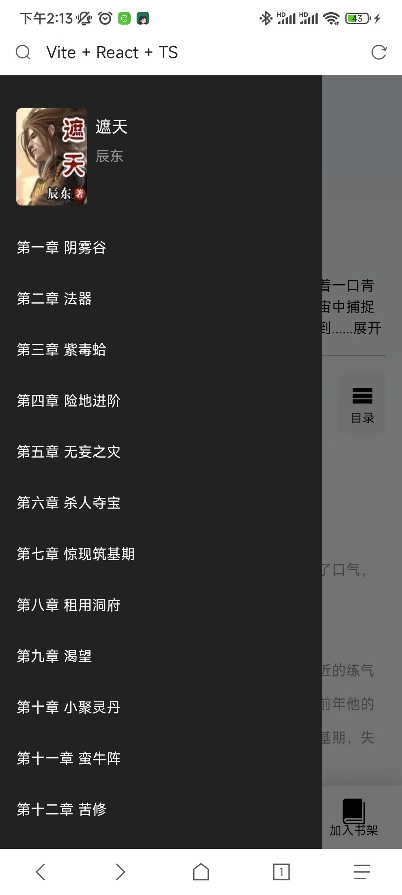

# 简介

模拟书城项目
前端： React18 + Vite + TS
服务端： NodeJS

## 练习

- 抽象和封装组件库，上传npm( madoc-react-mobileui )
- 练习自定义hooks，适应开发需求

### 支持功能

- 搜索书籍(保存记录、热门搜索)
- 阅读书籍(目录、样式设置、进度条)
- 书籍类别(分类、排行)
- 书架编辑(分组、删除)

### 截图

- 首页

- 分类

- 搜索

- 书籍分组

- 详情和阅读器

